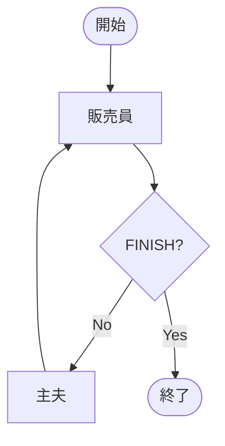

<!-- _class: lead -->

# LangGraph入門

## ノード・ステート・エージェント設計を学ぶ

---

## 本日の内容

1. **LangGraphとは**
2. **基本概念**：ステート、ノード、エッジ、グラフ
3. **実例で学ぶ**：
   - 基本的なグラフ（貯金箱アプリ）
   - ツールを使うエージェント
   - マルチエージェント対話
   - 高度なマルチエージェント（開発チーム）
4. **ベストプラクティス**
5. **まとめと次のステップ**

---

## LangGraphとは

**LangGraph**は、LangChainベースの**ステートフルなマルチアクターアプリケーション**を構築するフレームワークです。

### 特徴
- **グラフ構造**でワークフローを定義
- **ステート管理**が組み込み
- **条件分岐**や**ループ**が簡単に実装可能
- **マルチエージェント**システムの構築に最適

---

## なぜLangGraphが必要なのか

### 従来のLangChain
- シンプルなチェーン（A → B → C）
- 複雑な制御フローには不向き

### LangGraphの強み
- ✅ **複雑な条件分岐**が可能
- ✅ **ループや再試行**を簡単に実装
- ✅ **エージェント間の協調**がスムーズ
- ✅ **状態を明示的に管理**

---

<!-- _class: lead -->

# 基本概念

---

## ステート（State）の概念

**ステート**は、グラフ全体で共有される**状態情報**です。

```python
from typing import Annotated, TypedDict
import operator

class AgentState(TypedDict):
    messages: Annotated[Sequence[BaseMessage], operator.add]
    count: Annotated[int, operator.add]
```

### ポイント
- `TypedDict`で型を定義
- `Annotated`で集約方法を指定（`operator.add`で追加）
- ノード間で状態を受け渡し

---

## ステートの集約戦略

### `operator.add`の挙動

```python
# 初期状態
state = {"messages": [msg1], "count": 1}

# ノードが返す値
return {"messages": [msg2], "count": 1}

# 集約後の状態
# messages: [msg1, msg2]  # リストに追加
# count: 2                # 数値を加算
```

**重要**: `operator.add`により、値が**上書き**ではなく**追加/加算**されます。

---

## ノード（Node）の概念

**ノード**は、グラフ内の**処理単位**です。

```python
def my_node(state: AgentState) -> dict:
    """ノード関数"""
    # 状態を受け取る
    messages = state["messages"]

    # 処理を実行
    result = do_something(messages)

    # 更新する状態を返す
    return {"messages": [result]}
```

### ポイント
- 入力：現在の状態（State）
- 出力：更新する状態の辞書

---

## エッジ（Edge）の概念

**エッジ**は、ノード間の**接続**を定義します。

### 通常のエッジ
```python
workflow.add_edge("NodeA", "NodeB")  # A → B
```

### 条件付きエッジ
```python
def should_continue(state):
    if state["done"]:
        return "end"
    return "continue"

workflow.add_conditional_edges(
    "NodeA",
    should_continue,
    {"continue": "NodeB", "end": END}
)
```

---

## グラフ（Graph）の構築

```python
from langgraph.graph import StateGraph, END

# 1. グラフを初期化
workflow = StateGraph(AgentState)

# 2. ノードを追加
workflow.add_node("NodeA", node_a_function)
workflow.add_node("NodeB", node_b_function)

# 3. エッジを追加
workflow.add_edge("NodeA", "NodeB")
workflow.add_edge("NodeB", END)

# 4. エントリーポイントを設定
workflow.set_entry_point("NodeA")

# 5. コンパイル
graph = workflow.compile()
```

---

## グラフの実行

```python
# グラフを実行
result = graph.invoke({
    "messages": [],
    "count": 0
})

# 結果を取得
print(result["messages"])
print(result["count"])
```

---

<!-- _class: lead -->

# 実例1: 基本的なグラフ
## 貯金箱アプリ（work_1.py）

---

## シナリオ：貯金箱アプリ

目標金額に達するまでお金を貯金し続けるアプリ

### フロー
1. **入金**（Deposit）
2. **目標チェック**
   - 達成 → 終了（Full）
   - 未達成 → 再度入金
3. **終了処理**（Full）

---

## ステート定義

```python
from typing import Annotated, TypedDict
import operator

class PiggyBankState(TypedDict):
    total: Annotated[int, operator.add]       # 合計金額（加算）
    count: Annotated[int, operator.add]       # 貯金回数（加算）
    last_deposit: int                          # 最後の入金額
```

### ポイント
- `total`と`count`は`operator.add`で累積
- `last_deposit`は常に上書き（Annotatedなし）

---

## ノード実装

```python
def deposit(state: PiggyBankState) -> dict:
    """入金ノード"""
    amount = int(input("Enter the amount to deposit: "))
    return {
        "total": amount,      # totalに加算される
        "count": 1,           # countに加算される
        "last_deposit": amount  # 上書きされる
    }

def finalize(state: PiggyBankState) -> dict:
    """終了ノード"""
    print(f"{state['count']}回の貯金で目標金額に到達しました。")
    print(f"{state['total']}円貯まっています。")
    return {"total": 0}
```

---

## 条件分岐の実装

```python
def check_goal(state: PiggyBankState, goal: int) -> str:
    """目標金額をチェック"""
    if state["total"] >= goal:
        return "full"      # 目標達成
    else:
        return "continue"  # 継続
```

**ポイント**: 戻り値は文字列（エッジ名）

---

## グラフ構造


---

## グラフの構築

```python
import functools

def piggy_bank(goal: int):
    workflow = StateGraph(PiggyBankState)

    # ノード追加
    workflow.add_node("Deposit", deposit)
    workflow.add_node("Full", finalize)

    # 条件付きエッジ
    workflow.add_conditional_edges(
        "Deposit",
        functools.partial(check_goal, goal=goal),
        {"continue": "Deposit", "full": "Full"}
    )

    workflow.add_edge("Full", END)
    workflow.set_entry_point("Deposit")

    return workflow.compile()
```

---

## 実行結果例

```
Enter the amount to deposit: 300
Enter the amount to deposit: 400
Enter the amount to deposit: 500
3回の貯金で目標金額に到達しました。
1200円貯まっています。
最後の入金額は500円でした。
```

### 学んだこと
- ステートの集約（`operator.add`）
- 条件分岐（`add_conditional_edges`）
- ループ構造

---

<!-- _class: lead -->

# 実例2: ツールを使うエージェント
## シェルコマンド実行（work_2.py）

---

## シナリオ：シェルコマンド実行エージェント

LLMがツール（シェルコマンド）を使って質問に答えるエージェント

### フロー
1. **エージェント**：ユーザーの質問を理解し、必要に応じてツールを呼び出す
2. **ツール実行**：シェルコマンドを実行
3. **エージェント**：結果を元に回答を生成

---

## ツールの定義

```python
from langchain_core.tools import tool
import subprocess

@tool
def exec_command(shell_command: str) -> str:
    """シェルコマンドを実行します。
    shell_command: Linuxシェルコマンド
    """
    result = subprocess.run(
        shell_command,
        shell=True,
        capture_output=True
    )
    return result.stdout.decode("utf-8") + \
           result.stderr.decode("utf-8")
```

---

## ステート定義

```python
from typing import Annotated, Sequence, TypedDict
from langchain_core.messages import BaseMessage
import operator

class AgentState(TypedDict):
    messages: Annotated[Sequence[BaseMessage], operator.add]
```

### ポイント
- メッセージ履歴を管理
- `operator.add`でメッセージが追加される

---

## LLMとツールの統合

```python
from langchain_openai import AzureChatOpenAI

llm = AzureChatOpenAI(
    azure_deployment=os.environ.get("AZURE_OPENAI_CHAT_DEPLOYMENT"),
    api_key=os.environ.get("AZURE_OPENAI_API_KEY"),
    azure_endpoint=os.environ.get("AZURE_OPENAI_ENDPOINT"),
    api_version=os.environ.get("AZURE_OPENAI_VERSION"),
    temperature=0,
)

# ツールをバインド
llm_with_tool = llm.bind_tools([exec_command])
```

---

## エージェントノード

```python
def agent_node(state: AgentState):
    """エージェントノード：LLMを呼び出す"""
    messages = state["messages"]
    response = llm_with_tool.invoke(messages)
    return {"messages": [response]}
```

### 動作
1. 現在のメッセージ履歴を取得
2. LLMに送信（ツール呼び出しの判断も含む）
3. LLMの応答をメッセージとして返す

---

## ツールノード

```python
from langchain_core.messages import ToolMessage

def tool_node(state: AgentState):
    """ツールノード：ツールを実行"""
    messages = state["messages"]
    last_message = messages[-1]

    tool_messages = []
    for call in last_message.tool_calls:
        if call["name"] == "exec_command":
            value = exec_command.invoke(call["args"])
            tool_message = ToolMessage(
                content=value,
                name=call["name"],
                tool_call_id=call["id"],
            )
            tool_messages.append(tool_message)

    return {"messages": tool_messages}
```

---

## 条件分岐：ツール呼び出しの判定

```python
def should_continue(state: AgentState):
    """ツールを呼び出すか、終了するかを判定"""
    messages = state["messages"]
    last_message = messages[-1]

    if last_message.tool_calls:
        return "tool"   # ツールを呼び出す
    else:
        return "end"    # 終了
```

---

## グラフ構造


**ポイント**: エージェント ⇄ ツールのループ

---

## グラフの構築

```python
workflow = StateGraph(AgentState)

# ノード追加
workflow.add_node("Agent", agent_node)
workflow.add_node("Tool", tool_node)

# 条件付きエッジ
workflow.add_conditional_edges(
    "Agent",
    should_continue,
    {"tool": "Tool", "end": END}
)

# ツール → エージェント
workflow.add_edge("Tool", "Agent")

workflow.set_entry_point("Agent")
graph = workflow.compile()
```

---

## 実行結果例

```
query: 現在のディレクトリ内のファイル数を教えて

[内部処理]
1. Agent: "ls | wc -l" を実行すべきと判断
2. Tool: コマンド実行 → "42"
3. Agent: 結果を元に回答生成

[出力]
現在のディレクトリには42個のファイルがあります。
```

### 学んだこと
- ツールの統合
- エージェント ⇄ ツールのループ
- メッセージ履歴の管理

---

<!-- _class: lead -->

# 実例3: マルチエージェント対話
## 2エージェント対話（work_3.py）

---

## シナリオ：販売員と主夫の対話

壺の訪問販売員と主夫が対話するシステム

### 登場人物
- **坪田壺夫（販売員）**: 熱意ある壺の訪問販売員
- **堅木実（主夫）**: 堅実な主夫

### フロー
1. 販売員が提案
2. 主夫が応答
3. 販売員が判断（継続 or 終了）

---

## プロンプトテンプレート

```python
from langchain_core.prompts import ChatPromptTemplate

salesman_prompt = ChatPromptTemplate.from_messages([
    SystemMessage(
        "あなたは熱意ある壺のベテラン訪問販売員、坪田壺夫です。"
        "営業が終了したら、「FINISH」と回答してください。"
        "壺が売れるか、売れる見込みがない場合に営業を終了してください。"
    ),
    HumanMessage(content="こんにちは。どちら様でしょうか？"),
    ("placeholder", "{messages}"),
])

shed_prompt = ChatPromptTemplate.from_messages([
    SystemMessage("あなたは堅実な主夫の堅木実です。"),
    ("placeholder", "{messages}"),
])
```

---

## エージェント作成

```python
from langchain_openai import AzureChatOpenAI

llm = AzureChatOpenAI(...)

salesman_agent = salesman_prompt | llm
shed_agent = shed_prompt | llm
```

### ポイント
- プロンプトとLLMをパイプで接続（`|`）
- 各エージェントに異なるキャラクター設定

---

## ステート定義

```python
class AgentState(TypedDict):
    messages: Annotated[Sequence[BaseMessage], operator.add]
```

**シンプル**: メッセージ履歴のみを管理

---

## エージェントノード

```python
from langchain_core.messages import AIMessage

def agent_node(state, agent, name):
    """汎用エージェントノード"""
    result = agent.invoke(state)
    message = AIMessage(
        **result.model_dump(exclude={"type", "name"}),
        name=name
    )
    print(f"{name}: {message.content}")
    return {"messages": [message]}
```

### ポイント
- `functools.partial`で各エージェント専用のノードを作成
- メッセージに`name`を設定

---

## 専用ノードの作成

```python
import functools

salesman_node = functools.partial(
    agent_node,
    agent=salesman_agent,
    name="Salesman"
)

shed_node = functools.partial(
    agent_node,
    agent=shed_agent,
    name="SHED"
)
```

`functools.partial`で引数を部分適用

---

## 終了条件の判定

```python
def route(state):
    """販売員の応答に基づいて次の行動を決定"""
    messages = state["messages"]
    last_message = messages[-1]

    if "FINISH" in last_message.content:
        return "finish"    # 営業終了
    return "continue"      # 対話継続
```

---

## グラフ構造



**ポイント**: 販売員 ⇄ 主夫のループ

---

## グラフの構築

```python
workflow = StateGraph(AgentState)

# ノード追加
workflow.add_node("Salesman", salesman_node)
workflow.add_node("SHED", shed_node)

# 条件付きエッジ
workflow.add_conditional_edges(
    "Salesman",
    route,
    {"continue": "SHED", "finish": END}
)

# 主夫 → 販売員
workflow.add_edge("SHED", "Salesman")

workflow.set_entry_point("Salesman")
graph = workflow.compile()
```

---

## 実行結果例

```
Salesman: こんにちは！素晴らしい壺をご紹介に参りました！
SHED: すみません、今は結構です。
Salesman: この壺は運気を上げると評判なんですよ！
SHED: 興味ないです。お帰りください。
Salesman: かしこまりました。FINISH
```

### 学んだこと
- 複数エージェントの協調
- プロンプトによるキャラクター設定
- 明確な終了条件の重要性

---

<!-- _class: lead -->

# 実例4: 高度なマルチエージェント
## 開発チーム（work_4.py）

---

## シナリオ：ソフトウェア開発チーム

4つの役割を持つエージェントが協力してコードを開発

### チームメンバー
- **Leader**: チームの進行管理、役割割り当て
- **Programmer**: 仕様に基づいてコードを作成
- **TestWriter**: テストコードを作成
- **Evaluator**: コードとテストを実行、結果を分析

---

## ステート定義

```python
class AgentState(TypedDict):
    messages: Annotated[Sequence[BaseMessage], operator.add]
    next: str      # 次に実行するメンバー
    task: str      # 開発タスク
```

### ポイント
- `messages`: 会話履歴
- `next`: リーダーが決定する次の担当者
- `task`: 開発する機能の仕様

---

## Structured Outputの活用

```python
from pydantic import BaseModel, Field

class LeaderResponse(BaseModel):
    reasoning: str = Field(description="決定の背後にある理由。")
    next: Union[Literal["Finish"], str] = Field(
        description="次にアクションを行うチームメンバ。"
    )
    instructions: str = Field(description="次のチームメンバへの指示。")
```

**ポイント**: LLMの出力を構造化し、確実に`next`を取得

---

## ツールの定義

```python
@tool
def evaluate(code: str, test: str) -> tuple[str, str]:
    """
    コードをテストし、標準出力と標準エラーのペアを返す。
    """
    with open("product.py", "w") as f:
        f.write(code)
    with open("test_product.py", "w") as f:
        f.write(test)
    result = subprocess.run(
        ["pytest", "test_product.py"],
        capture_output=True
    )
    return result.stdout.decode(), result.stderr.decode()
```

Evaluatorが使用するツール

---

## エージェント作成

```python
def create_agent(llm, name: str):
    """役割に応じたプロンプトを生成"""
    prompt = ChatPromptTemplate.from_messages([
        SystemMessagePromptTemplate.from_template(
            "あなたはソフトウェア開発チームの一員の{name}です。"
            "チームメンバ: {members}\n\n"
            "{member_roles}"
        ),
        HumanMessagePromptTemplate.from_template("task: {task}\n"),
        MessagesPlaceholder("messages"),
    ]).partial(name=name, members=members, member_roles=member_roles)

    return prompt | llm
```

---

## エージェントのインスタンス化

```python
llm = AzureChatOpenAI(...)

# Leaderは構造化出力を使用
leader_agent = create_agent(
    llm.with_structured_output(LeaderResponse),
    "Leader"
)

programmer_agent = create_agent(llm, "Programmer")
tester_agent = create_agent(llm, "TestWriter")
evaluator_agent = create_agent(
    llm.bind_tools([evaluate]),
    "Evaluator"
)
```

---

## リーダーノード

```python
def leader_node(state: AgentState) -> dict:
    """リーダエージェント"""
    response = leader_agent.invoke(state)
    return {
        "messages": [
            HumanMessage(content=response.instructions, name="Leader")
        ],
        "next": response.next,  # 次の担当者を決定
    }
```

**ポイント**: `next`を更新して次のメンバーを指定

---

## メンバーノード

```python
def member_node(state: AgentState, agent, name: str) -> dict:
    """汎用メンバーノード"""
    result = agent.invoke(state)

    # ツール呼び出しのバリデーション（省略）

    return {
        "messages": [
            AIMessage(**result.model_dump(exclude={"type", "name"}), name=name)
        ]
    }

# 各メンバー専用のノード
programmer_node = functools.partial(member_node, agent=programmer_agent, name="Programmer")
tester_node = functools.partial(member_node, agent=tester_agent, name="TestWriter")
evaluator_node = functools.partial(member_node, agent=evaluator_agent, name="Evaluator")
```

---

## ツールノード（ToolNode）

```python
from langgraph.prebuilt import ToolNode

# ツールノードを作成
tool_node = ToolNode([evaluate])
```

**ポイント**: `ToolNode`はツール呼び出しを自動処理

---

## ルーティング

```python
def router(state: AgentState) -> str:
    """Evaluatorがツールを呼び出すかどうかを判定"""
    messages = state["messages"]
    last_message = messages[-1]

    if last_message.tool_calls:
        return "call_tool"
    return "continue"
```

---

## グラフ構造


---

## グラフの構築

```python
workflow = StateGraph(AgentState)

# ノード追加
workflow.add_node("Leader", leader_node)
workflow.add_node("Evaluator", evaluator_node)
workflow.add_node("Tool", ToolNode([evaluate]))
workflow.add_node("Programmer", programmer_node)
workflow.add_node("TestWriter", tester_node)

# Evaluatorからのルーティング
workflow.add_conditional_edges(
    "Evaluator",
    router,
    {"continue": "Leader", "call_tool": "Tool"}
)

# Leaderからのルーティング
workflow.add_conditional_edges(
    "Leader",
    lambda x: x["next"],
    {
        "Programmer": "Programmer",
        "TestWriter": "TestWriter",
        "Evaluator": "Evaluator",
        "Finish": END,
    },
)

workflow.add_edge("Programmer", "Leader")
workflow.add_edge("TestWriter", "Leader")
workflow.add_edge("Tool", "Evaluator")

workflow.set_entry_point("Leader")
```

---

## 実行結果例

```
task: フィボナッチ数列のN番目を返す関数を実装してください

Leader: Programmerさん、フィボナッチ関数を実装してください
Programmer: [コード実装]
Leader: TestWriterさん、テストを書いてください
TestWriter: [テスト実装]
Leader: Evaluatorさん、実行して確認してください
Evaluator: [ツール呼び出し] → テスト成功
Leader: 完了しました。Finish
```

---

## 学んだこと

- **役割分担**: 各エージェントに明確な責任
- **Structured Output**: LLMの出力を構造化
- **ToolNode**: ツール呼び出しの簡略化
- **動的ルーティング**: `lambda x: x["next"]`でリーダーの判断に基づく分岐
- **複雑なワークフロー**: 複数のノードと条件分岐の組み合わせ

---

<!-- _class: lead -->

# ベストプラクティス

---

## ステート設計のコツ

### 1. 必要最小限の情報
```python
# ❌ 過剰
class State(TypedDict):
    messages: List[BaseMessage]
    message_count: int  # messagesから計算可能
    last_message: str   # messagesから取得可能

# ✅ シンプル
class State(TypedDict):
    messages: Annotated[Sequence[BaseMessage], operator.add]
```

### 2. 適切な集約戦略
- **追加/加算**: `operator.add`
- **上書き**: Annotatedなし

---

## ノード設計のコツ

### 1. 単一責任の原則
```python
# ❌ 複数の責任
def process_node(state):
    data = fetch_data()      # データ取得
    result = analyze(data)   # 分析
    save(result)             # 保存
    return {"result": result}

# ✅ 責任を分離
def fetch_node(state): ...
def analyze_node(state): ...
def save_node(state): ...
```

---

## ノード設計のコツ（続き）

### 2. 純粋関数として設計
```python
# ❌ 副作用あり（グローバル変数の変更）
global_counter = 0
def bad_node(state):
    global global_counter
    global_counter += 1
    return {"count": global_counter}

# ✅ 純粋関数
def good_node(state):
    return {"count": 1}  # operator.addで加算される
```

**ポイント**: ステートのみを使い、外部状態に依存しない

---

## エージェント設計のコツ

### 1. 明確な役割定義
```python
MEMBERS = {
    "Leader": "チームの進行を管理し、役割を割り当てる",
    "Programmer": "仕様に基づいてコードを書く",
    "TestWriter": "テストを書く",
    "Evaluator": "コードとテストを実行し、結果を分析する",
}
```

役割が明確であるほど、エージェントは効果的に動作します。

---

## エージェント設計のコツ（続き）

### 2. 適切な終了条件
```python
# ✅ 明確な終了条件
def should_continue(state):
    if state["goal_reached"]:
        return "end"
    if state["max_iterations"] >= 10:
        return "end"  # 無限ループ防止
    return "continue"
```

**重要**: 無限ループを防ぐため、必ず終了条件を設定

---

## デバッグとテスト

### 1. 状態の可視化
```python
result = graph.invoke(initial_state)

# ステップごとの状態を確認
for step in result:
    print(f"Step: {step}")
    print(f"State: {result[step]}")
```

### 2. ノード単体のテスト
```python
# ノードを個別にテスト
state = {"messages": [HumanMessage(content="test")]}
result = my_node(state)
assert "messages" in result
```

---

<!-- _class: lead -->

# まとめ

---

## 学んだこと

1. **ステート（State）**: TypedDict + Annotatedで状態管理
2. **ノード（Node）**: 処理単位、入力はState、出力は更新する状態
3. **エッジ（Edge）**: ノード間の接続、条件分岐も可能
4. **グラフ（Graph）**: StateGraph → add_node/add_edge → compile

### 実例で学んだパターン
- 基本的なループと条件分岐（貯金箱）
- ツールを使うエージェント（シェルコマンド）
- マルチエージェント対話（販売員と主夫）
- 高度なマルチエージェント（開発チーム）

---

## 次のステップ

### 1. 公式ドキュメント
- [LangGraph Documentation](https://langchain-ai.github.io/langgraph/)
- より高度な機能を学ぶ

### 2. より高度なパターン
- **Persistence**: グラフの状態を永続化
- **Human-in-the-loop**: 人間の承認を含むワークフロー
- **Streaming**: リアルタイムな出力
- **Subgraphs**: グラフのネスト

### 3. 実践
- 自分のユースケースに適用
- 複数エージェントの協調システムを構築

---

<!-- _class: lead -->

# Q&A

ご質問はありますか？

---

<!-- _class: lead -->

# ありがとうございました

Happy Coding with LangGraph!
